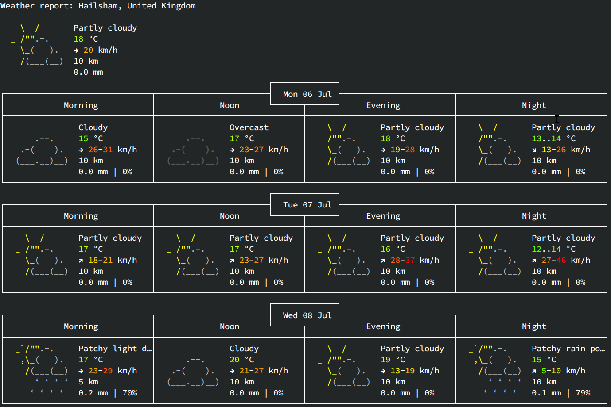

# > $ curl wttr.in



## Description
This is probably one of the fastest ways to check the weather. wttr.in gives you a colorful customisable output thanks to open-source projects such as [wego](https://github.com/schachmat/wego) and [pyphoon](https://github.com/chubin/pyphoon).
The service goes way beyond just basic querying and provides a wide range of ways t oselect a location (Hostnames, famous places, cities, countries, airports) with all kinds of output which are not limited to text based views such as JSON but also
images! Check their [github page](https://github.com/chubin/wttr.in) to learn more about it.

## Usage
You can just let it guess where you are without any arguments:

```
curl wttr.in
```

Give it a city:

```
curl wttr.in/London
```

Try with a 3 letter airport code:

```
curl wttr.in/muc      # Weather for IATA: muc, Munich International Airport, Germany
curl wttr.in/ham      # Weather for IATA: ham, Hamburg Airport, Germany
```
Or if you want to be really specific you can use a place with ~:

```
curl wttr.in/~Eiffel+Tower
curl wttr.in/~Kilimanjaro
```

## Tips and Trivia
I will let you guess what this does:

```
curl wttr.in/Moon
```


This would probably be less useful but for some reason you can also use IPs (hostnames) to specify a location:

```
curl wttr.in/@github.com
curl wttr.in/@msu.ru
```

Use their help page for full instructions:

```
curl wttr.in/:help
```

## Links
- [Github](https://github.com/chubin/wttr.in)
- [Website](https://wttr.in/)